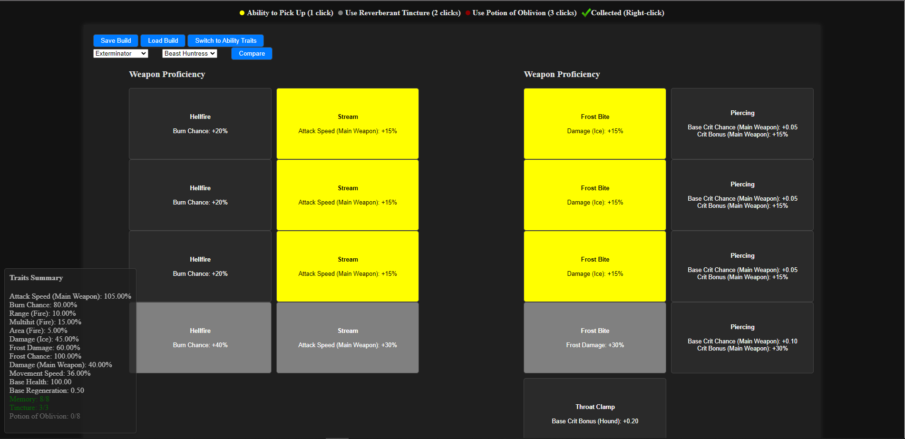
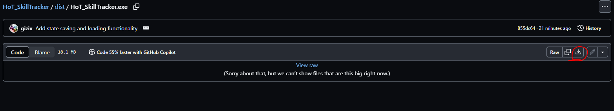
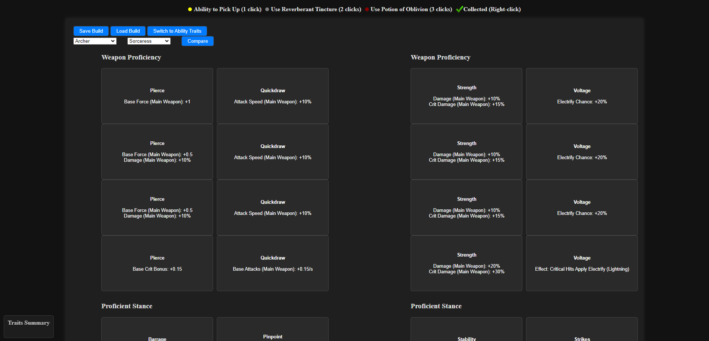
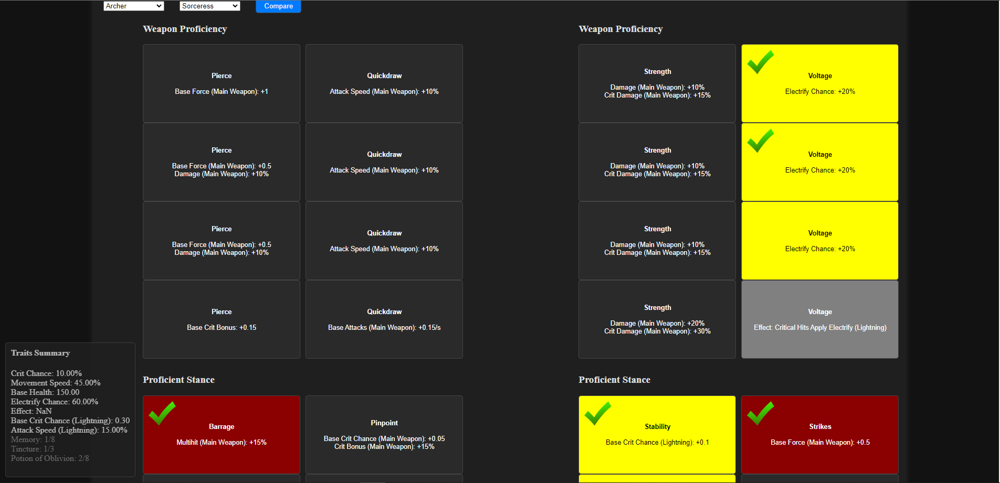
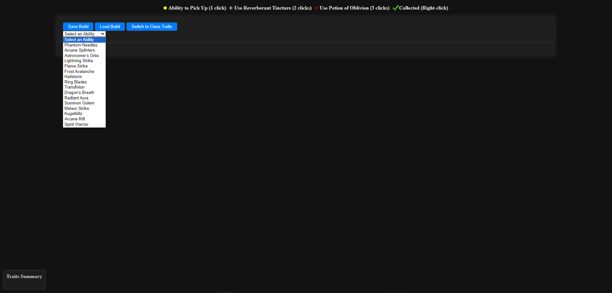
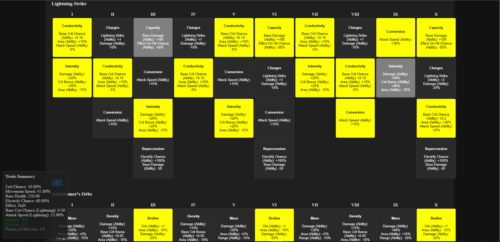
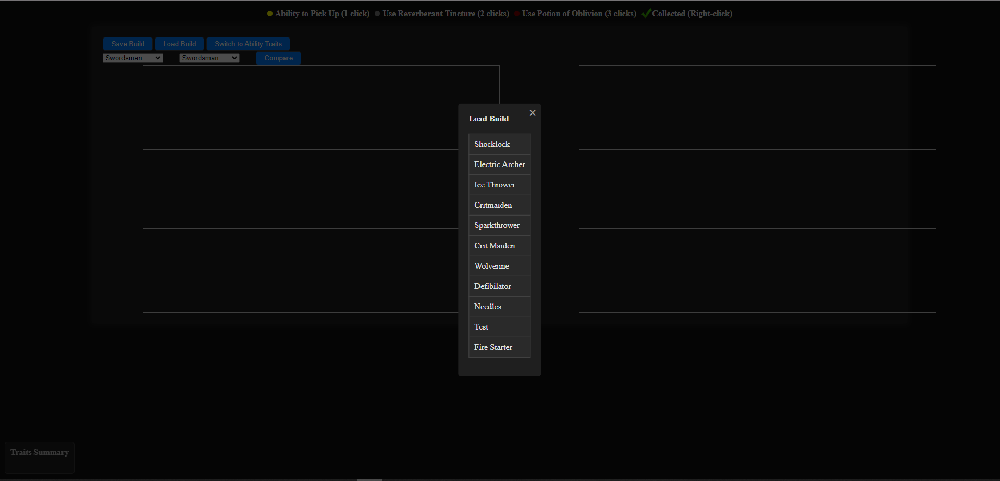

# HoT_SkillTracker

## About
This application is a skill tracker for the game "Halls of Torment".
It provides an easy-to-use interface to track skills and builds in the game.
Installation instructions are below.

## Features
- **Skill Tracking**: Manage and view your game builds.
- **Profile Management**: Save and retrieve your profiles directly in the browser.

## How It Works
- **Saving Profiles**: Utilizes browser local storage to save user profiles for quick access.
- **Backend**: Built with Flask, handling routing and server-side logic.
- **Frontend**: Interactive UI built with HTML, CSS, and JavaScript.

## Easy to Start
Now with an easy double click .exe file! 

You can use the exe from this project or download it here:
https://github.com/gizix/HoT_SkillTracker/blob/855dc645bc08540ab34a6c88483aeadb2124103b/dist/HoT_SkillTracker.exe

Click `Download raw file`

Converted Flask server to use pywebview for a single file executable style program.
File is located in the dist folder `dist/HoT_SkillTracker.exe`

### To Build .exe Yourself
From the project directory
1. `pip install pyinstaller`
2. Edit the sample.spec file line `pathex=['path\\to\\the\\project'],` to match your settings.
3. `pyinstaller sample.spec`
4. Run `dist/HoT_SkillTracker.exe`

## Installation with Poetry
1. Clone the repository: `git clone https://github.com/gizix/HoT_SkillTracker.git`
2. Install Poetry if not already installed: `pip install poetry`
3. Navigate to the project directory: `cd HoT_SkillTracker`
4. Install dependencies with Poetry: `poetry install --no-root`
#### Running the Flask Server with Poetry Setup
1. Activate the Poetry environment: `poetry shell`
2. Set environment variables: `export FLASK_APP=app`
3. Run the server: `flask run`
4. Access the application at `localhost:5000` in your browser.

## Installation with Pip
1. Clone the repository: `git clone https://github.com/gizix/HoT_SkillTracker.git`
2. Navigate to the project directory: `cd HoT_SkillTracker`
3. Install dependencies with Pip: `pip install -r requirements.txt`
#### Running the Flask Server with Pip Setup
1. Activate your Python environment.
2. Navigate to the project directory: `cd HoT_SkillTracker`
3. Set environment variables: `export FLASK_APP=app`
4. Run the server: `flask run`
5. Access the application at `localhost:5000` in your browser.

## Using the interface
First, choose which classes you will be using.  
The left most dropdown is the primary class and the right is the secondary class.
Click compare and the class traits will be generated for each in two columns.
The primary class is in the left column, the secondary class is in the right column.

Keep track of which skills your build should take by clicking on a trait once.
This highlights it in yellow to signify a selected trait.
Clicking a trait a second time will turn it grey.  This marks it for use with a reverberant tincture.
Clicking a third time will mark it in red, signifying to use a potion of oblivion.
Right-clicking marks the trait with a green check mark.  This is useful for keeping track of your build during a run.

A summary of trait effects is displayed in the bottom left.
Clicking Switch to Ability Traits will change the view.
The view is empty until you select an ability to add from the dropdown.

For each ability selected, it will add the clickable traits below.
These buttons behave exactly like the class traits and will also calculate potions of memory/tincture/oblivion.
The effects are not tracked yet.

### Saving a build
Click on Save Build and either select an existing build to overwrite or click New Build.
Enter the name of your build in the prompt and click ok.  Your build will be saved in your browser's local storage.

### Loading a build
Click on Load Build and select one of your previously saved builds.

## Contributing
Contributions are welcome. Please fork the repository and submit a pull request.

## License
[MIT License](LICENSE)
